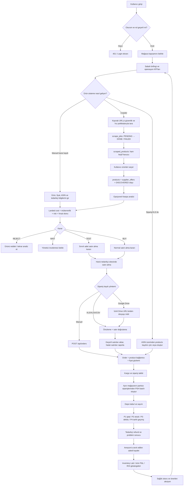
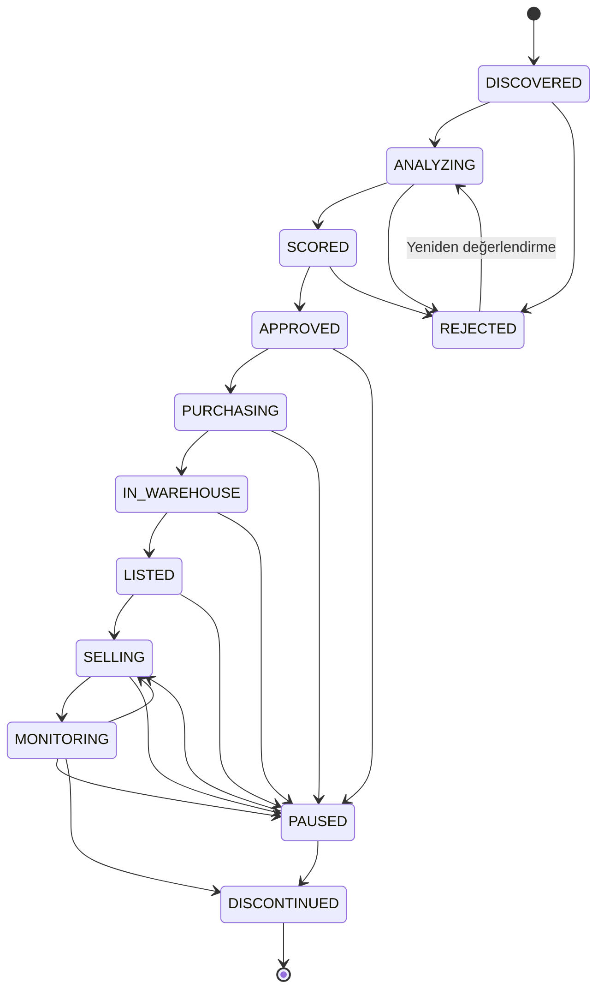

# CERBERUS — Uçtan Uca Proje İş Akışı

**Tarih:** 14 Eylül 2026  
**Kapsam:** Mevcut kodun uyguladığı AS-IS iş akışı  
**Amaç:** Ürün keşfinden operasyonel ölçüm ve yönetici kararına kadar aktörleri, sistem adımlarını, kontrolleri ve manuel sınırları tek belgede göstermek.

## 1. İşin kısa tanımı

CERBERUS; çok mağazalı online arbitraj operasyonunda ürün keşfi, ürün analizi, satın alma kaydı, depo/PSH süreci, fire yönetimi ve kârlılık karar desteğini tek uygulamada birleştirir.

Ana değer döngüsü:

```text
KEŞFET → ANALİZ ET → KARAR VER → SATIN AL → KAYDET → DEPOYA AL
→ BATCH OLUŞTUR → AMAZON'A SEVK ET → ÖLÇ → AKSİYON ÜRET → TEKRAR ÖĞREN
```

> Amazon SP-API bağlı değildir. Tedarikçi sitesindeki gerçek satın alma ve Amazon listeleme/satış işlemleri CERBERUS dışında yapılır; CERBERUS bunların operasyonel kayıt ve karar katmanıdır.

## 2. Aktörler ve yetkiler

| Aktör | İş kapsamı |
|---|---|
| `ADMIN` | Tüm mağazalar, operasyon, kullanıcı/mağaza yönetimi ve geliştirme ortamındaki kontrollü veritabanı araçları |
| `MANAGER` | Tüm mağazalarda operasyon ve sermaye kararı doğuran ürün yaşam döngüsü geçişleri; kullanıcı yönetimi yok |
| `STORE_USER` | Yalnız atandığı mağazanın sipariş ve operasyon verisi |
| Sistem | Karar, tazelik, P&L, KPI ve brifing hesapları; doğrulama, audit ve readiness kontrolleri |
| Harici servisler | Kaynak siteler, opsiyonel Keepa API, opsiyonel Scrapling browser servisi, Google Drive |

Mağaza kısıtı yalnız arayüzde değildir. Sunucu, `STORE_USER` tarafından gönderilen farklı bir `storeCode` değerini kullanıcının kendi mağaza kapsamına indirger.

## 3. Uçtan uca ana akış



## 4. Ürün yaşam döngüsü

Yaşam döngüsü geçişleri `ADMIN` veya `MANAGER` tarafından gerekçe girilerek yapılır. Her geçiş hem olay defterine hem audit kaydına yazılır.



## 5. Adım bazlı iş akışı matrisi

| No | Süreç | Girdi | Sistem işlemi | Çıktı / kayıt | Ana API / veri |
|---:|---|---|---|---|---|
| 1 | Kimlik doğrulama | E-posta, parola | bcrypt doğrulama, imzalı HttpOnly oturum | Yetkili kullanıcı ve mağaza kapsamı | `/api/auth/login`, `users` |
| 2 | Yönetici brifingi | Aktif mağaza kapsamı | Sipariş ve ürün verilerinden KPI/uyarı hesaplama | Sağlık skoru ve en önemli aksiyonlar | `/api/intelligence`, `/api/orders/summary` |
| 3 | Crawler keşfi | İzinli ürün/kategori URL'si | SSRF, DNS/IP, redirect, boyut ve kullanıcı hız kontrolleri | Tarama işi ve ham ürün havuzu | `/api/crawler/scrape`, `scrape_jobs`, `scraped_products` |
| 4 | Crawler import | Seçili ham ürünler | ASIN çözme, ürünü tekilleştirme, fiyat gözlemi ve lifecycle olayı | Normalize ürün ve tedarikçi teklifi | `/api/crawler/import`, `products`, `supplier_offers` |
| 5 | Keepa analizi | ASIN, alış/satış fiyatı | 24 saat cache; BSR, rekabet ve fiyat istikrarı analizi | Keepa sinyalleri ve karar önerisi | `/api/keepa/analyze`, `keepa_cache` |
| 6 | Karar motoru | Landed cost, ROI, duplicate ve risk sinyalleri | Eşiklere göre `BUY`, `TEST`, `WAIT` veya `REJECT` | Karar, güven, politika ve kanıt | `/api/intelligence`, `product_masters` |
| 7 | Satın alma | Onaylanan ürün | İşlem harici tedarikçi sitesinde manuel yapılır | Tedarikçi sipariş numarası | CERBERUS dışında |
| 8 | Sipariş kaydı | Manuel form, dosya veya Drive XLS | Şema ve miktar doğrulama, mağaza kapsamı, mükerrer kontrol, ürün çözümleme | 40 kolonlu sipariş kaydı | `/api/orders`, `/api/orders/import-xls`, `orders` |
| 9 | PSH batch | Aynı mağazaya ait partisiz siparişler | Tek transaction, eşzamanlı atama ve mağaza kontrolü | Batch ve bağlı siparişler | `/api/batches`, `psh_batches` |
| 10 | Depo ve problem | Gelen/sevk edilen/fire adetleri | `shipped ≤ quantity`, `P1+P2+P3+P4 ≤ quantity` kontrolleri | Güncel kargo, depo ve problem durumu | `/api/orders/{id}`, `orders` |
| 11 | Finansal ölçüm | Maliyet, sevk adedi, satış fiyatı, refund | Net maliyet, gelir, kâr ve ROI hesapları | Ürün P&L, sağlık kararı, aksiyon | `/api/products/{id}`, analytics |
| 12 | Geri besleme | Operasyon ve finans sonuçları | Fire, sevk, tazelik, kâr ve bekleyen işlerden özet üretme | Ertesi brifingi ve yeni yönetim aksiyonu | `/api/intelligence` |

## 6. Temel iş kuralları

### Sipariş ve miktar

- Her sipariş geçerli bir ASIN üzerinden bir `products` kaydına bağlıdır.
- Mükerrerlik anahtarı `buyerStore + orderNumber + asin` üçlüsüdür.
- `quantity` pozitif tam sayıdır.
- `shippedToAmazon`, sipariş miktarını aşamaz.
- `P1 + P2 + P3 + P4`, sipariş miktarını aşamaz.
- Bundle ürününde `countPerBundle` zorunludur.

### Batch

- Bir batch yalnız tek mağazanın siparişlerini içerir.
- Bir sipariş aynı anda yalnız bir batch'e bağlanabilir.
- Batch oluşturma ve sipariş atama aynı transaction içinde yapılır.

### Finans

`refundAmount`, müşteriye yapılan satış iadesi değil, tedarikçinin ödeme kartına yaptığı geri ödemedir. Bu nedenle gelirden değil maliyetten düşülür:

```text
effectiveCost = max(0, totalCost - supplierRefund)
revenue       = shippedToAmazon × sellingPrice
netProfit     = revenue - effectiveCost
ROI           = effectiveCost > 0 ? netProfit / effectiveCost × 100 : ölçülemez
```

Hiç Amazon sevkiyatı yoksa ROI `0` kabul edilmez; **ölçülemez** olarak gösterilir.

### Güvenlik ve gizlilik

- Anonim API çağrıları reddedilir.
- Rol ve mağaza kapsamı sunucuda uygulanır.
- Kart ve sipariş e-postası gibi alanlar role göre maskelenir.
- Kritik create/update/delete, import, crawler, Keepa ve yaşam döngüsü işlemleri audit izi üretir.

## 7. Hata ve alternatif akışlar

| Durum | Sistem davranışı |
|---|---|
| Geçersiz/iptal edilmiş oturum | `401`, kullanıcı tekrar girişe yönlendirilir |
| Başka mağazaya erişim | `403` veya istek kullanıcının mağazasına kilitlenir |
| Hatalı import satırı | Yalnız ilgili satır atlanır; geçerli satırlar kaydedilir ve hata listesi döner |
| Tüm import satırları hatalı | `400`, işlem başarılı gösterilmez |
| Mükerrer sipariş | `409`, aynı mağaza + order no + ASIN yeniden yazılmaz |
| Sipariş başka batch'e eşzamanlı atandı | Transaction geri alınır ve `409` döner |
| Crawler hedefi güvenli değil | İstek dış ağa çıkmadan reddedilir |
| Crawler timeout/parse hatası | Job `FAILED`; kullanıcıya tekrar denenebilir hata döner |
| Keepa kotası aşıldı | `429` ve tekrar deneme bilgisi döner |
| Migration/seed/integrity sorunu | `/api/health/ready` `503` döner; trafik için hazır sayılmaz |

## 8. Manuel ve otomatik sınırlar

### Sistem içinde otomatik olanlar

- Rol ve mağaza kapsamı
- Sipariş/import doğrulaması
- Ürün-ASIN çözümleme ve fiyat gözlemi
- Duplicate, landed cost, risk ve fırsat hesabı
- Batch bütünlüğü
- Fire/sevk miktar kuralları
- KPI, P&L, ROI göstergesi, sağlık kararı ve brifing
- Audit ve readiness kontrolleri

### Hâlen manuel veya harici olanlar

- Tedarikçi sitesinde sipariş verme ve ödeme
- Amazon listeleme, gerçek satış ve müşteri iadesi
- Kargo/depo sonuçlarını sisteme girme
- Ürün yaşam döngüsü geçişini gerekçeyle onaylama
- Keepa anahtarı yoksa gerçek pazar verisi edinme

## 9. Mevcut akıştaki kritik kopukluklar

1. **Crawler → karar kasası bağlantısı tam otomatik değil.** Crawler import `products` ve `supplier_offers` oluşturur; `product_masters` karar kaydını kendiliğinden üretmez.
2. **Keepa kararı kalıcı ürün kararına otomatik bağlanmıyor.** Sonuç cache ve audit'e yazılır; yaşam döngüsünü veya karar kasasını otomatik ilerletmez.
3. **Satın alma emri varlığı yok.** `APPROVED → PURCHASING` geçişi ile gerçek tedarikçi siparişi arasında ayrı bir `purchase_order`/onay kaydı bulunmaz.
4. **Gerçek Amazon satışı ölçülmüyor.** SP-API olmadığı için gelir, `shippedToAmazon × sellingPrice` üzerinden operasyonel bir vekil ölçümdür; gerçek satış, Amazon ücreti ve müşteri iadesi değildir.
5. **İki ürün modeli geçiş döneminde birlikte yaşıyor.** `products` ilişkisel doğruluk kaynağıyken `product_masters` legacy karar kasasıdır; iki kayıt arasında zorunlu FK bulunmaz.
6. **Brifing tarihsel snapshot tutmuyor.** “Dünden bugüne” eğilimini güvenilir biçimde gösterecek günlük briefing tablosu bulunmaz.

## 10. Önerilen hedef akış

Öncelik sırasıyla:

1. Crawler/manuel keşfi tek `product_candidate` sürecinde birleştirmek.
2. Keepa analizini aynı aday kaydına bağlayıp `ANALYZING → SCORED` geçişini otomatikleştirmek.
3. `BUY/TEST` sonrası onaylı `purchase_orders` ve kalemlerini oluşturmak.
4. Sipariş kaydını purchase order ile eşleştirerek “karar verildi ama alınmadı” ve “alındı ama kaydedilmedi” açıklarını raporlamak.
5. Amazon SP-API ile listing, satış, ücret ve müşteri iadesini ayrı gerçekler olarak almak.
6. Günlük sağlık snapshot'larıyla karar kalitesini ve tahmin-gerçekleşen sapmasını dönemsel izlemek.

Hedef zincir:

```text
CANDIDATE → ENRICHED → SCORED → APPROVAL → PURCHASE_ORDER → SUPPLIER_ORDER
→ RECEIVING → PSH_BATCH → FBA_INBOUND → LISTING → SALE → SETTLEMENT
→ REALIZED_P&L → LEARNING
```

## 11. Süreç başarı göstergeleri

- Keşiften karara geçen ortalama süre
- `BUY/TEST → purchase order` dönüşüm oranı
- Sipariş kayıt hata ve mükerrerlik oranı
- Batch'siz sipariş sayısı ve bekleme süresi
- FBA sevk oranı
- P1–P4 fire oranı ve kök neden dağılımı
- Tedarikçi refund geri kazanım oranı
- Tahmini ROI ile gerçekleşen ROI sapması
- Ürün başına kanıt kapsamı ve veri tazeliği
- Mağaza bazında net kâr ve sermaye dönüş hızı
